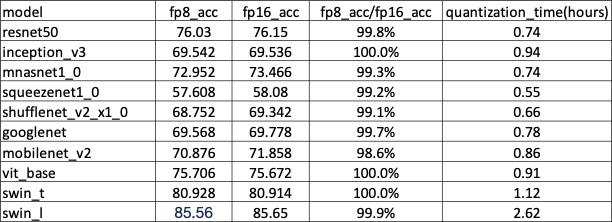

## Descritpion

This is an example of FP8 static quantization. It uses cpu for FP8 quantization, which can solve the problems of insufficient memory and efficiency of FP8 quantization in poprt. It is a supplement to the FP8 quantization tool in poprt.

This example automatically calculates the accuracy of the FP8 model under different fp8_params and fp8_skip_op_names and saves it in a csv file.

## Run

1. First, we need to re-implement the `get_dataloader get_calibrate_dataloader eval_ipu_model` functions in `analyze_fp8.py`.
   `get_dataloader` and `eval_ipu_model` are used to evaluate model metrics based on the actual test set.
   `get_calibrate_dataloader` is used to calculate quantization errors. A total of **200 to 500** images is sufficient. It does not need to return label, but only input.

1. Run code sample

   ```Python
   python analyze_fp8.py
       --batch_size 8
       --input_shapes input=8,3,224,224
       --model_path ./resnet.onnx
       --val_dir ./imagenet/validation
       --output_path ./output.csv
   ```

1. Algorithm

   - Firstly, the scale of FP8 model is set successively as \[-5,-4,-3,-2,-1,0,1,2\], and the precision is calculated. The scale with the highest precision is selected as the final scale.
   - Then, the quantization error of each conv/matmul/gemm in FP8 model is calculated using ppq, and eight ops with the largest quantization error are selected.
   - Finally, each of the eight ops is set to FP16 one by one, and the accuracy is calculated to select the case with the highest accuracy.

1. Results

   
